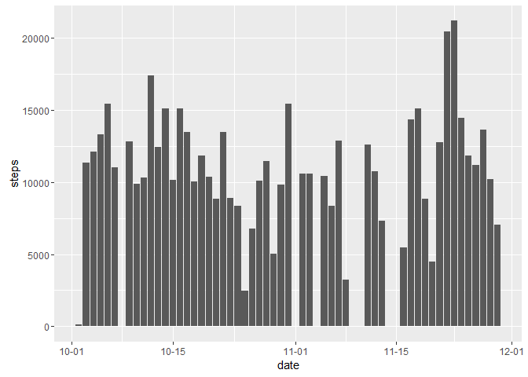
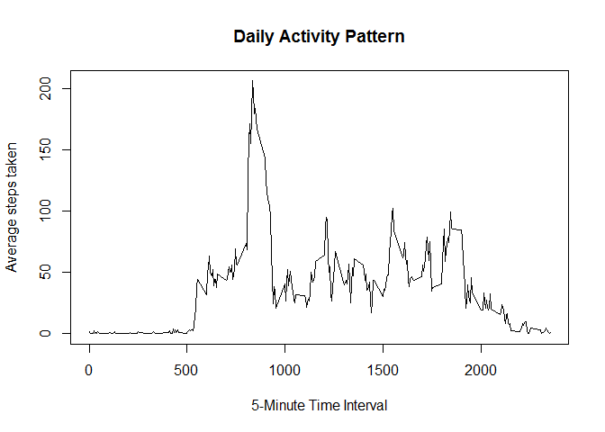
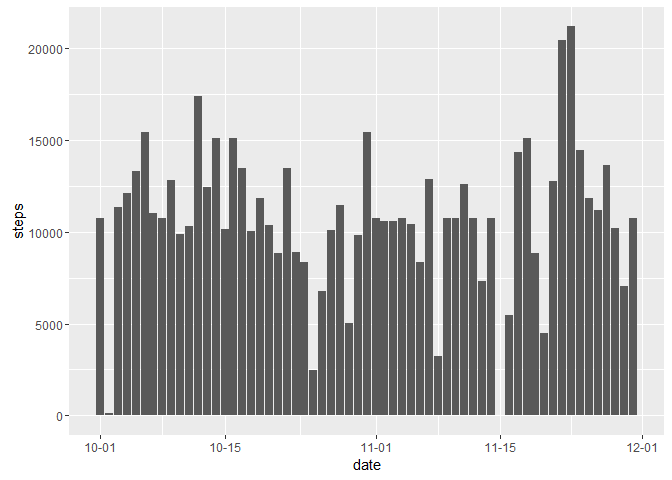
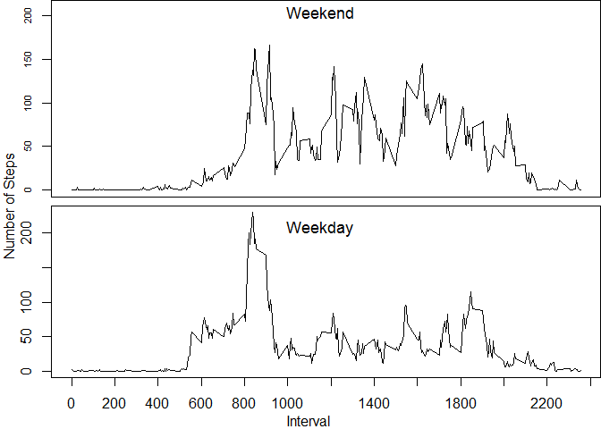

# Reproducible Research: Peer Assessment 1


## Loading and preprocessing the data


```r
        ##Loading Data      
               
                ##create vector with the name of the directory
                p1   <- file.path(fsep = "/",  
                         "C:",
                         "Users",
                         "Parry_2",
                         "Google Drive",
                         "Data Analytics", 
                         "Coursera - John Hopkins DS Specialization",
                         "05 Reproducible Research",
                         "Practice, Projects and Quizes",
                         "Course Project 1",
                         "repdata-data-activity")  
        
                ##set working directory to directory with data
                setwd(p1)
                
                ##read in data; "Not Available" = NA
                repdata <- read.csv("activity.csv",
                        na.strings = "Not Available", stringsAsFactors = FALSE)

        ##Preprocessing data
       
                #Store date variable as a date and not character string
                repdata$date <- as.Date(repdata$date)
                class(repdata$date)
              
                #store steps and interval variables as number and not string
                repdata$steps <- as.numeric(repdata$steps)
                repdata$interval <- as.numeric(repdata$interval)
```

## What is the total number of steps taken per day?
###Histogram of the total steps per day


```r
        ##Load plotting package
        library(ggplot2)
        library(scales)
        
       #Histogram of total number of steps per day
        ggplot(data = repdata, aes(date, steps)) +
                stat_summary(fun.y = sum,#sums all observations for each day
                geom = "bar") +
                scale_x_date(labels = date_format("%m-%d")) 
```

<!-- -->

### Mean and median number of steps taken per day


```r
        #Mean by day
        aggregate(repdata[,1],by=list(repdata$date),mean, na.rm = TRUE)
```

```
##       Group.1          x
## 1  2012-10-01        NaN
## 2  2012-10-02  0.4375000
## 3  2012-10-03 39.4166667
## 4  2012-10-04 42.0694444
## 5  2012-10-05 46.1597222
## 6  2012-10-06 53.5416667
## 7  2012-10-07 38.2465278
## 8  2012-10-08        NaN
## 9  2012-10-09 44.4826389
## 10 2012-10-10 34.3750000
## 11 2012-10-11 35.7777778
## 12 2012-10-12 60.3541667
## 13 2012-10-13 43.1458333
## 14 2012-10-14 52.4236111
## 15 2012-10-15 35.2048611
## 16 2012-10-16 52.3750000
## 17 2012-10-17 46.7083333
## 18 2012-10-18 34.9166667
## 19 2012-10-19 41.0729167
## 20 2012-10-20 36.0937500
## 21 2012-10-21 30.6284722
## 22 2012-10-22 46.7361111
## 23 2012-10-23 30.9652778
## 24 2012-10-24 29.0104167
## 25 2012-10-25  8.6527778
## 26 2012-10-26 23.5347222
## 27 2012-10-27 35.1354167
## 28 2012-10-28 39.7847222
## 29 2012-10-29 17.4236111
## 30 2012-10-30 34.0937500
## 31 2012-10-31 53.5208333
## 32 2012-11-01        NaN
## 33 2012-11-02 36.8055556
## 34 2012-11-03 36.7048611
## 35 2012-11-04        NaN
## 36 2012-11-05 36.2465278
## 37 2012-11-06 28.9375000
## 38 2012-11-07 44.7326389
## 39 2012-11-08 11.1770833
## 40 2012-11-09        NaN
## 41 2012-11-10        NaN
## 42 2012-11-11 43.7777778
## 43 2012-11-12 37.3784722
## 44 2012-11-13 25.4722222
## 45 2012-11-14        NaN
## 46 2012-11-15  0.1423611
## 47 2012-11-16 18.8923611
## 48 2012-11-17 49.7881944
## 49 2012-11-18 52.4652778
## 50 2012-11-19 30.6979167
## 51 2012-11-20 15.5277778
## 52 2012-11-21 44.3993056
## 53 2012-11-22 70.9270833
## 54 2012-11-23 73.5902778
## 55 2012-11-24 50.2708333
## 56 2012-11-25 41.0902778
## 57 2012-11-26 38.7569444
## 58 2012-11-27 47.3819444
## 59 2012-11-28 35.3576389
## 60 2012-11-29 24.4687500
## 61 2012-11-30        NaN
```

```r
        #Median by day
        aggregate(repdata[,1],by=list(repdata$date),median, na.rm= TRUE)
```

```
##       Group.1  x
## 1  2012-10-01 NA
## 2  2012-10-02  0
## 3  2012-10-03  0
## 4  2012-10-04  0
## 5  2012-10-05  0
## 6  2012-10-06  0
## 7  2012-10-07  0
## 8  2012-10-08 NA
## 9  2012-10-09  0
## 10 2012-10-10  0
## 11 2012-10-11  0
## 12 2012-10-12  0
## 13 2012-10-13  0
## 14 2012-10-14  0
## 15 2012-10-15  0
## 16 2012-10-16  0
## 17 2012-10-17  0
## 18 2012-10-18  0
## 19 2012-10-19  0
## 20 2012-10-20  0
## 21 2012-10-21  0
## 22 2012-10-22  0
## 23 2012-10-23  0
## 24 2012-10-24  0
## 25 2012-10-25  0
## 26 2012-10-26  0
## 27 2012-10-27  0
## 28 2012-10-28  0
## 29 2012-10-29  0
## 30 2012-10-30  0
## 31 2012-10-31  0
## 32 2012-11-01 NA
## 33 2012-11-02  0
## 34 2012-11-03  0
## 35 2012-11-04 NA
## 36 2012-11-05  0
## 37 2012-11-06  0
## 38 2012-11-07  0
## 39 2012-11-08  0
## 40 2012-11-09 NA
## 41 2012-11-10 NA
## 42 2012-11-11  0
## 43 2012-11-12  0
## 44 2012-11-13  0
## 45 2012-11-14 NA
## 46 2012-11-15  0
## 47 2012-11-16  0
## 48 2012-11-17  0
## 49 2012-11-18  0
## 50 2012-11-19  0
## 51 2012-11-20  0
## 52 2012-11-21  0
## 53 2012-11-22  0
## 54 2012-11-23  0
## 55 2012-11-24  0
## 56 2012-11-25  0
## 57 2012-11-26  0
## 58 2012-11-27  0
## 59 2012-11-28  0
## 60 2012-11-29  0
## 61 2012-11-30 NA
```

## What is the average daily activity pattern?
### Time Series plot of the average steps taken each day 

```r
        ##Matrix of the average steps per interval 
        avginterval <- aggregate(repdata[,1], by=list(repdata$interval), 
                                mean, na.rm = TRUE)
        
        ##Plot steps per interval
        plot(avginterval[,1], avginterval[,2],
                main = "Daily Activity Pattern",
                xlab = "5-Minute Time Interval",
                ylab = "Average steps taken",
                type = "l" ##That is type lowercase "L" not numeric "1"
         )
```

<!-- -->

## Imputing missing values

### Imputation Strategy  

```r
##Replace missing data with mean steps for the day 
        
        ##Makes a matrix with average steps per day 
        newsteps <- aggregate(steps ~ interval, data = repdata, FUN = mean) 
        ##Makess a new vector with missing filled in 
        
        fillna <- numeric() #Make empty "fillna" vector
        
        for (i in 1:nrow(repdata)) { obs <- repdata[i, ] 
        
        if (is.na(obs$steps)) {steps <- subset(newsteps, 
        interval == obs$interval)$steps } 
        
        else { steps <- obs$steps } 
        
        fillna <- c(fillna, steps) } #fillna vector gets average steps when NA
        
        #Make a new data.frame
        newrep <- repdata 
        
        #New data.frame gets fillna vector (which has imputed values)
        #which replaces steps column (which doesn't have imputed values)
        newrep$steps <- fillna 
```

### Histogram of total number of steps taken each day after missing values are imputed 


```r
        ggplot(data = newrep,
        aes(date, steps)) +
        stat_summary(fun.y = sum, # adds up all observations for the day
        geom = "bar") + 
        scale_x_date(labels = date_format("%m-%d"))
```

<!-- -->


## Are there differences in activity patterns between weekdays and weekends?

###Prepare the data


```r
##Create a factor variable with two levels 

        #Assign named days of the week (e.g., Monday) to day vector 
        day <- weekdays(repdata$date) 
        
        #Make empty vector for factor variable with weekend vs. weekday
        level <- vector() 
        
        #Add to empty "level" vector "weekend" or "weekday" designations
        for (i in 1:nrow(repdata)) {
                
                if (day[i] == "Saturday") 
                { level[i] <- "Weekend" } 
                
                else if (day[i] == "Sunday") 
                { level[i] <- "Weekend" }
                
                else { level[i] <- "Weekday" } 
                
                } 
        
        #Add level vector with "weekday" or "weekend" designation to data
        newrep$level <- level
        
        #Make level column a factor variable
        newrep$level <- factor(newrep$level)
        
        #Calculate mean of steps of intervals
        stepbyday <- aggregate(steps ~ interval + level, data = newrep, mean) 
        #Name columns
        names(stepbyday) <- c("interval", "level", "steps")
        
        #Make a list with two data.frames. One with weekend data and one with weekday data
        levellist <- split(stepbyday, stepbyday$level, drop = TRUE)
            
        #Assign weekend data in list to new data.frame    
        weekend <- levellist[[2]]
        
        #Assign weekday data in list to new data.frame    
        weekday <- levellist [[1]]
```

###Plot weekend vs. weekday activity pattern - Average number of steps per interval


```r
        #Set plot parameters 
            par(mfrow=c(2,1),
            pin = c(10, 10),  
            mar = c(.5,2,0,0),
            oma = c(1,1,0,0),
            lab = c(10, 6, 5))
            
        #Plot weekend data   
        plot(weekend$interval,weekend$steps,
             #xlab = "5-minute time interval",
             #ylab = "Average steps taken",
             type = "l", 
             
             xaxt = "n", ## No x axis 
             ylim = c(0,210),
             xlim = c(0,2355),                        
             cex.axis = .7)
        text(1150, 220, "Weekend",pos = 1, cex = 1.1)
        par(mar = c(2,2,0,0))
          
        ##Plot weekday data  
        plot(weekday$interval, weekday$steps, 
             #xlab = "5-minute time interval",
             #ylab = "Average steps taken",
             type = "l" 
             )
                
        text(1150, 230, "Weekday", pos = 1, cex = 1.1)                     
        mtext("Number of Steps", side = 2, outer = TRUE)
        mtext("Interval", side = 1, outer = TRUE)
```

<!-- -->
